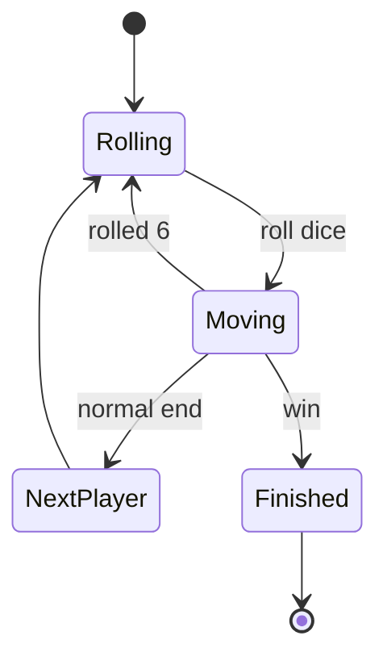
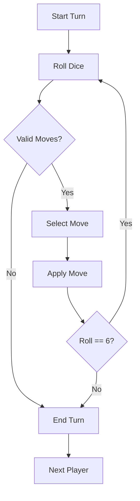
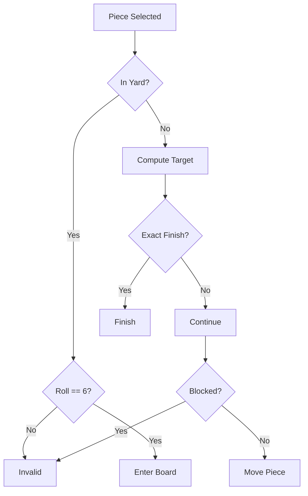
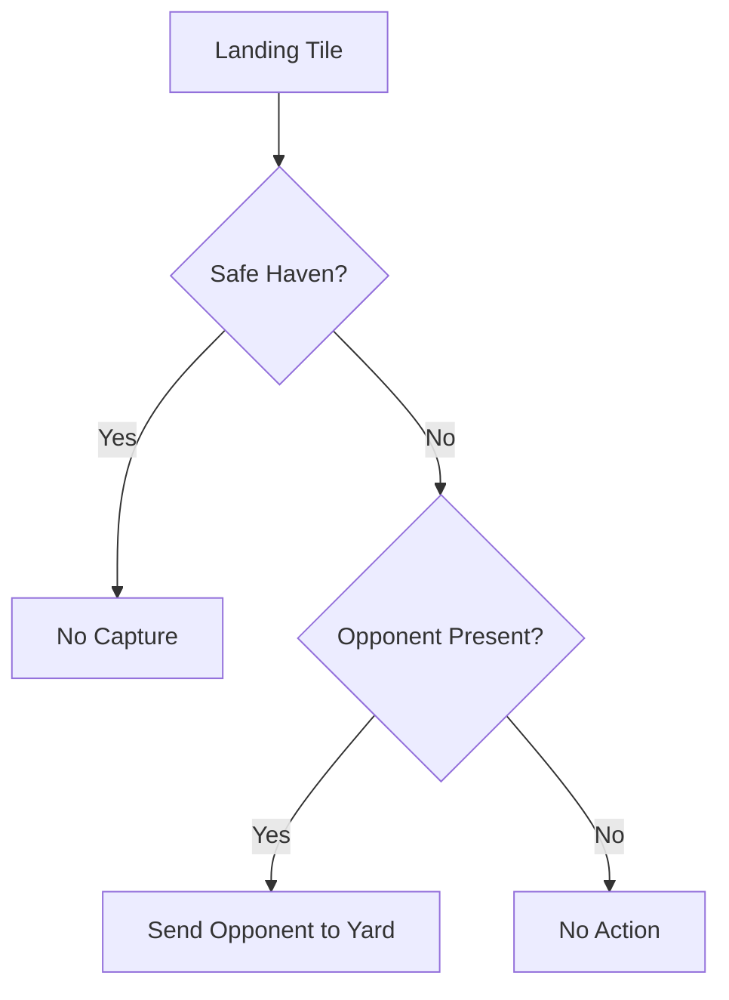
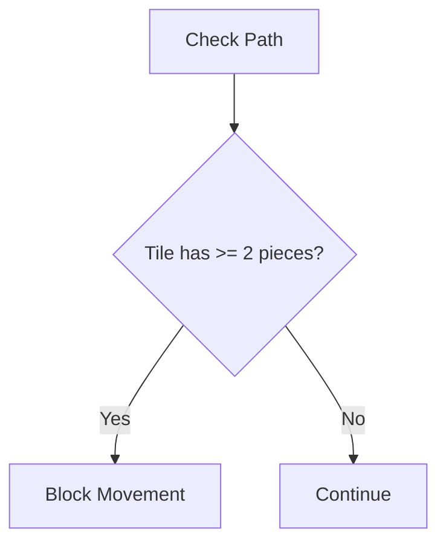
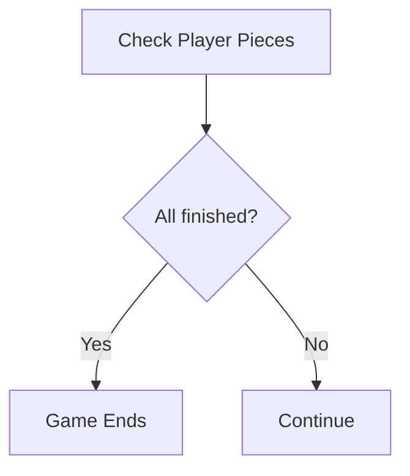

# 🧠 Computer Rules (Formal Spec)

This file defines the **authoritative game logic** using state machines and flowcharts.

---

# ✅ 1. State Machine (Authoritative)

---

# ✅ 2. Turn Flow

---

# ✅ 3. Move Validation

---

# ✅ 4. Capture Logic

---

# ✅ 5. Blockade Rules

---

# ✅ 6. Win Condition

---

# ✅ Guarantees

- no invalid state transitions
- no illegal moves
- deterministic gameplay
- fairness handled separately

